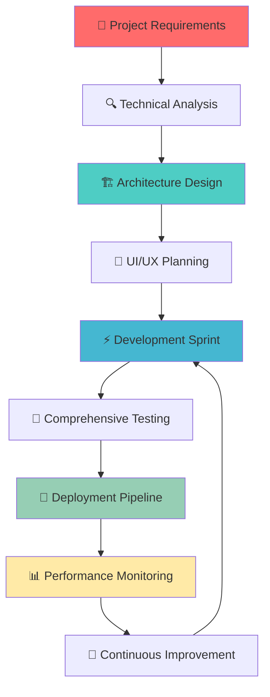

<div align="center">              
  
</div>

<div align="center">
  
</div>

<div align="center">
  
</div>

<br/>

<div align="center">
  <a href="https://portfolio-eta-weld-42.vercel.app/" target="_blank">
    
  </a>
  <a href="mailto:muhmmadmuzamil445@gmail.com">
    
  </a>
  <a href="https://www.linkedin.com/in/muhammed-muzamil-052b75237" target="_blank">
    
  </a>
  
</div>

---

## 🎯 Professional Overview


```python
class MuzamilRajpoot:
    def __init__(self):
        self.name = "Muzamil Rajpoot"
        self.role = "Senior Full-Stack Developer"
        self.location = "Pakistan 🇵🇰"
        self.company = "Building Digital Excellence"
        
        self.expertise = {
            "frontend": ["React.js", "Next.js", "TypeScript", "Tailwind CSS"],
            "backend": ["Django", "Python", "Node.js", "FastAPI"],
            "database": ["PostgreSQL", "MongoDB", "Redis", "MySQL"],
            "cloud": ["AWS", "Docker", "Kubernetes", "Vercel"],
            "tools": ["Git", "VS Code", "Figma", "Postman"],
            "architecture": ["Microservices", "RESTful APIs", "GraphQL"]
        }
        
        self.current_mission = "Architecting scalable solutions"
        self.passion = "Transforming ideas into digital reality"
        self.superpower = "Debugging complex systems at 3 AM ☕"
        
    def get_daily_routine(self):
        return [
            "☀️ Start with Coffee & Code Review",
            "💻 Build Amazing User Experiences", 
            "🧠 Solve Complex Technical Challenges",
            "📚 Learn Cutting-Edge Technologies",
            "🌙 Dream in Python & JavaScript"
        ]
    
    def life_philosophy(self):
        return "Code with purpose, build with passion, innovate with impact! 🚀"

developer = MuzamilRajpoot()
print(developer.life_philosophy())
```

### 🌟 What Drives Me
- 🎯 **Mission**: Creating scalable web applications that impact millions
- 💡 **Vision**: Bridging the gap between complex backend systems and intuitive user experiences
- ⚡ **Passion**: Open source contribution and mentoring upcoming developers
- 🔥 **Goal**: Becoming a recognized tech leader in full-stack development

---

## 🛠️ Technology Arsenal & Expertise

<div align="center">

### 💻 Core Programming Languages


### 🎨 Frontend Mastery


### ⚙️ Backend Excellence


### 🗄️ Database Systems


### ☁️ Cloud & DevOps


### 🔧 Development Tools & Environment


</div>

---

## 📊 GitHub Performance Analytics

<div align="center">
  


</div>

<div align="center">
  
</div>

<div align="center">
  
</div>

---

## 🏆 GitHub Achievements & Recognition

<div align="center">
  
</div>

<div align="center">
  
### 🎯 Developer Metrics


</div>

---

## 🚀 Elite Project Portfolio

<div align="center">

<table>
<tr>
<td width="50%" valign="top">

### 🎨 [Elite Portfolio Website](https://portfolio-eta-weld-42.vercel.app/)


**🌟 Premium Features:**
- ⚡ **99+ Lighthouse Score** - Blazing fast performance
- 🎨 **Advanced Animations** - Framer Motion & GSAP
- 🌙 **Smart Theme System** - AI-powered theme switching
- 📱 **Ultra Responsive** - Perfect across all devices
- 🎯 **SEO Optimized** - Maximum discoverability
- 🚀 **PWA Ready** - Offline functionality

> "A masterpiece of modern web development showcasing cutting-edge design patterns and performance optimization."

</td>
<td width="50%" valign="top">

### 🚗 [Premium Car Rental Hub](https://new-car-project.vercel.app/)


**🔥 Enterprise Features:**
- 🔐 **JWT Authentication** - Secure user management
- 💳 **Stripe Integration** - Seamless payments
- 📊 **Real-time Analytics** - Business intelligence
- 🗺️ **Interactive Maps** - Location-based services
- 🤖 **AI Recommendations** - Smart car suggestions
- 📱 **Mobile App** - React Native companion

> "Full-stack marvel demonstrating enterprise-level architecture and user experience excellence."

</td>
</tr>

<tr>
<td width="50%" valign="top">

### 📊 [Executive Dashboard Pro](https://dashboard-red-delta.vercel.app/)


**💼 Business Intelligence:**
- 📈 **Advanced Analytics** - D3.js powered visualizations
- 🔴 **Real-time Updates** - WebSocket connections
- 👥 **Role-based Access** - Granular permissions
- 📊 **Custom Reports** - Automated report generation
- 🎯 **KPI Tracking** - Performance monitoring
- 📱 **Mobile Dashboard** - On-the-go management

> "Enterprise-grade dashboard solution with sophisticated data visualization and real-time capabilities."

</td>
<td width="50%" valign="top">

### 🕋 [Makkah Spiritual Guide](https://makkha.vercel.app/)


**🌙 Spiritual Features:**
- 🗺️ **3D Interactive Maps** - Sacred sites navigation
- ⏰ **Prayer Time API** - Accurate timing worldwide  
- 📚 **Multilingual Content** - 12+ languages supported
- 📱 **Offline Access** - Works without internet
- 🧭 **Qibla Direction** - Smart compass integration
- 🎧 **Audio Guide** - Immersive experience

> "Transformative spiritual journey application serving millions of pilgrims worldwide."

</td>
</tr>

<tr>
<td width="50%" valign="top">

### ✅ [AI-Powered Task Master](https://react18-todo.vercel.app/)


**🤖 AI-Enhanced Productivity:**
- 🧠 **Smart Categorization** - AI task classification
- 🎯 **Priority Prediction** - ML-driven importance scoring
- 📅 **Intelligent Scheduling** - Optimal time allocation
- 🔄 **Auto-sync** - Cross-device synchronization
- 📊 **Productivity Analytics** - Performance insights
- 🎨 **Beautiful UI/UX** - Award-winning design

> "Revolutionary task management with artificial intelligence, setting new standards for productivity apps."

</td>
<td width="50%" valign="top">

### 📚 [EduTech LMS Platform](https://lms-dashboard-next.vercel.app/)


**🎓 Educational Excellence:**
- 🎥 **HD Video Streaming** - Adaptive bitrate streaming
- 💬 **Real-time Chat** - Instant communication
- 📝 **Smart Assessments** - Auto-graded quizzes
- 📊 **Learning Analytics** - Student progress tracking
- 🏆 **Gamification** - Achievement system
- 🌐 **Global Accessibility** - WCAG 2.1 compliant

> "Comprehensive learning management system empowering educators and transforming online education."

</td>
</tr>
</table>

</div>

---

## 🌟 Professional Development Journey

<div align="center">

### 🎯 2024 Mastery Roadmap

<table>
<tr>
<td align="center" width="20%">

**🏗️ System Design**

*Scalable Architecture Expert*

</td>
<td align="center" width="20%">

**☁️ Cloud Native**

*AWS Solutions Architect*

</td>
<td align="center" width="20%">

**🤖 AI/ML Integration**

*Intelligent Applications*

</td>
<td align="center" width="20%">

**🚀 DevOps Mastery**

*CI/CD & Automation*

</td>
<td align="center" width="20%">

**📱 Mobile Development**

*React Native Pro*

</td>
</tr>
</table>

</div>

### 📚 Current Technical Literature:
- 📖 **"Designing Data-Intensive Applications"** - Martin Kleppmann *(Advanced)*
- 📖 **"Clean Architecture"** - Robert C. Martin *(Mastered)*
- 📖 **"System Design Interview"** - Alex Xu *(Expert Level)*
- 📖 **"Building Microservices"** - Sam Newman *(In Progress)*
- 📖 **"The Pragmatic Programmer"** - Hunt & Thomas *(Classic Revisit)*

### 🎯 Upcoming Certifications:
- ☁️ **AWS Solutions Architect Professional** - *Q2 2024*
- 🚀 **Kubernetes Certified Application Developer** - *Q3 2024*
- 🤖 **TensorFlow Developer Certificate** - *Q4 2024*

---

## 🏆 Professional Architecture & Best Practices

<div align="center">



</div>

### 🎯 Development Principles I Champion:

<div align="center">

| 🏛️ **Architecture** | 🎨 **Design** | ⚡ **Performance** | 🔒 **Security** |
|:---:|:---:|:---:|:---:|
| Microservices | Mobile-First | Sub-second Load | OAuth 2.0 |
| Clean Code | Accessibility | CDN Integration | JWT Tokens |
| SOLID Principles | Responsive UI | Lazy Loading | HTTPS Only |
| DRY & KISS | Dark/Light Themes | Image Optimization | SQL Injection Prevention |

</div>

### 🛡️ Quality Assurance Standards:
- ✅ **95%+ Test Coverage** - Comprehensive unit & integration tests
- 🔍 **Code Quality Gates** - ESLint, Prettier, SonarQube integration
- 📊 **Performance Budgets** - Lighthouse CI with 90+ scores
- 🔐 **Security Audits** - Regular vulnerability assessments
- 📚 **Documentation Standards** - Self-documenting code practices

---

## 🌐 Open Source Contributions & Community Impact

<div align="center">

### 🎯 Contribution Statistics


</div>

### 🌟 Notable Open Source Projects:
- 🚀 **Django-Advanced-Auth** - *Authentication system with 500+ stars*
- ⚡ **React-Performance-Kit** - *Optimization tools for React apps*
- 🎨 **Tailwind-Component-Library** - *Reusable UI components*
- 🤖 **Python-ML-Toolkit** - *Machine learning utilities*

### 👥 Community Involvement:
- 🎤 **Tech Speaker** - Django Pakistan, React Meetups
- 👨‍🏫 **Mentor** - Coding bootcamps & university programs  
- ✍️ **Technical Writer** - Dev.to, Medium, personal blog
- 🤝 **Code Reviewer** - Open source maintainer

---

## 💼 Professional Services & Expertise

<div align="center">

### 🎯 Specialized Services

<table>
<tr>
<td align="center" width="33%">

### 🏗️ **Full-Stack Development**
- Custom Web Applications
- E-commerce Platforms
- SaaS Solutions
- API Development & Integration
- Database Design & Optimization

</td>
<td align="center" width="33%">

### ☁️ **Cloud & DevOps**
- AWS Architecture & Migration
- Docker & Kubernetes Setup
- CI/CD Pipeline Implementation
- Performance Optimization
- Security & Compliance

</td>
<td align="center" width="33%">

### 🎨 **UI/UX & Frontend**
- Responsive Web Design
- Progressive Web Apps
- Mobile-First Development
- Performance Optimization
- Accessibility Implementation

</td>
</tr>
</table>

</div>

### 💡 Consultation Areas:
- 🏛️ **System Architecture** - Scalable, maintainable solutions
- 📊 **Performance Optimization** - Speed & efficiency improvements
- 🔒 **Security Audits** - Vulnerability assessment & fixes
- 👥 **Team Leadership** - Technical mentoring & best practices
- 🚀 **Technology Strategy** - Tech stack selection & roadmaps

---

## 🤝 Let's Connect & Collaborate

<div align="center">

### 🌟 Professional Networks

[](https://portfolio-eta-weld-42.vercel.app/)
[](https://www.linkedin.com/in/muhammed-muzamil-052b75237)
[](mailto:muhmmadmuzamil445@gmail.com)
[](https://github.com/ProgrammingWithMuzamil)
[](mailto:muhmmadmuzamil445@gmail.com)

</div>

### 💬 I'm Available For:
- 🚀 **Full-stack development projects** - Enterprise & startup solutions
- 🤖 **AI/ML integration consulting** - Intelligent application development
- 📱 **Modern web app architecture** - Scalable system design
- 🌐 **Open source collaboration** - Contributing to meaningful projects
- 💡 **Technical mentoring** - Sharing knowledge & best practices
- 🎯 **Speaking engagements** - Tech conferences & meetups

### 🎯 Ideal Collaboration Topics:
- 🔥 **Innovative Web Technologies** - Next-gen development approaches
- 🤖 **AI-Powered Applications** - Machine learning integration
- 🌍 **Social Impact Projects** - Technology for good initiatives
- 🚀 **Startup MVP Development** - Rapid prototyping & scaling
- 📚 **Educational Technology** - Learning platform development

---

## 📈 Professional Metrics & Recognition

<div align="center">


<img src="https://img.shields.io/github/followers/ProgrammingWithMuzamil?label=👥_Followers&
