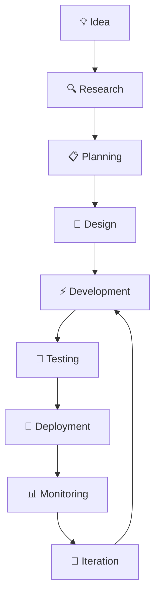

<div align="center">
  
</div>

<div align="center">
  
</div>

<br/>

<div align="center">
  
</div>

---

## 🎯 About Me


```javascript
const muzamil = {
    pronouns: "He/Him",
    location: "Pakistan 🇵🇰",
    role: "Full-Stack Developer",
    company: "Building Amazing Things",
    techStack: {
        frontend: ["React", "Next.js", "TypeScript"],
        backend: ["Django", "Python", "Node.js"],
        database: ["PostgreSQL", "MongoDB", "MySQL"],
        cloud: ["AWS", "Docker", "Vercel"],
        tools: ["Git", "Figma", "VS Code"]
    },
    currentFocus: "Mastering System Design & Cloud Architecture",
    futureGoals: "Data Science & AI/ML Integration",
    hobbies: ["Problem Solving", "Open Source", "Tech Blogging"],
    funFact: "I debug with console.log and I'm not ashamed! 😄"
};
```

<div align="center">
  
**🔥 Passionate about creating scalable, user-friendly applications that solve real-world problems**

</div>

---

## 🛠️ Tech Arsenal

<div align="center">

### 💻 Programming Languages


### 🎨 Frontend Technologies


### ⚙️ Backend & Server


### 🗄️ Databases


### ☁️ Cloud & DevOps


### 🔧 Development Tools


</div>

---

## 📊 GitHub Analytics & Performance

<div align="center">
  
  
  
  
</div>

<div align="center">
  
</div>

<div align="center">
  
</div>

---

## 🏆 GitHub Achievements

<div align="center">
  
</div>

---

## 🚀 Featured Projects

<div align="center">

<table>
<tr>
<td width="50%">

### 🎨 [Personal Portfolio](https://portfolio-eta-weld-42.vercel.app/)


Modern, responsive portfolio with dark/light themes, smooth animations, and interactive components.

**Key Features:**
- ⚡ Lightning-fast performance
- 🎨 Modern UI/UX design
- 📱 Fully responsive
- 🌙 Dark/Light mode

</td>
<td width="50%">

### 🚗 [Car Rental Platform](https://new-car-project.vercel.app/)


Full-stack car rental system with booking management, payment integration, and admin dashboard.

**Key Features:**
- 🔐 User authentication
- 💳 Payment integration
- 📊 Admin dashboard
- 🔍 Advanced search & filters

</td>
</tr>

<tr>
<td width="50%">

### 📊 [Admin Dashboard](https://dashboard-red-delta.vercel.app/)


Comprehensive admin dashboard with analytics, user management, and real-time data visualization.

**Key Features:**
- 📈 Real-time analytics
- 👥 User management
- 📱 Mobile responsive
- 🎯 Interactive charts

</td>
<td width="50%">

### 🕋 [Makkah Guide](https://makkha.vercel.app/)


Spiritual journey web application for pilgrims with guides, maps, and prayer times.

**Key Features:**
- 🗺️ Interactive maps
- ⏰ Prayer time tracker
- 📚 Comprehensive guides
- 🌍 Multi-language support

</td>
</tr>

<tr>
<td width="50%">

### ✅ [Modern Task Manager](https://react18-todo.vercel.app/)


Advanced todo application with drag-drop, categories, deadlines, and progress tracking.

**Key Features:**
- 🎯 Drag & drop interface
- 📅 Deadline management
- 🏷️ Categories & tags
- 📊 Progress analytics

</td>
<td width="50%">

### 📚 [LMS Dashboard](https://lms-dashboard-next.vercel.app/)


Learning Management System with course tracking, assignments, and student progress monitoring.

**Key Features:**
- 🎓 Course management
- 📝 Assignment tracking
- 👨‍🎓 Student analytics
- 💬 Interactive discussions

</td>
</tr>
</table>

</div>

---

## 🎯 Development Workflow & Best Practices

<div align="center">



</div>

### 🏗️ Architecture Principles I Follow:
- **🧩 Modular Design** - Clean, reusable components
- **📱 Mobile-First** - Responsive across all devices  
- **⚡ Performance** - Optimized for speed and efficiency
- **🔒 Security** - Following security best practices
- **♿ Accessibility** - Inclusive design for everyone
- **🧪 Testing** - Comprehensive test coverage
- **📚 Documentation** - Well-documented code

---

## 🌟 Current Learning Journey

<div align="center">

### 🎯 2024 Focus Areas

| 🧠 Learning Path | 📈 Progress | 🎯 Goal |
|------------------|-------------|---------|
| **System Design** |  | Master scalable architectures |
| **Cloud Native** |  | AWS Solutions Architect |
| **Data Science** |  | ML/AI integration in web apps |
| **DevOps** |  | CI/CD & Infrastructure |
| **Mobile Dev** |  | React Native mastery |

</div>

### 📚 Currently Reading:
- 📖 "Designing Data-Intensive Applications" by Martin Kleppmann
- 📖 "Clean Architecture" by Robert C. Martin
- 📖 "System Design Interview" by Alex Xu

---

## 🤝 Let's Connect & Collaborate

<div align="center">
  
[](https://portfolio-eta-weld-42.vercel.app/)
[](https://www.linkedin.com/in/muhammed-muzamil-052b75237)
[](mailto:muhmmadmuzamil445@gmail.com)
[](https://github.com/ProgrammingWithMuzamil)

</div>

### 💬 Let's Talk About:
- 🚀 Full-stack development projects
- 🤖 AI/ML integration in web applications  
- 📱 Modern web technologies and frameworks
- 🌐 Open source contributions
- 💡 Innovative product ideas
- 🎯 Career growth and opportunities

---

## 📈 Contribution Stats

<div align="center">
  
  
  
</div>

---

<div align="center">
  
</div>

<div align="center">
  
### 🚀 "Code is not just my profession, it's my passion for creating digital experiences that matter"

**⭐ If you find my work valuable, please consider starring my repositories!**  
**🤝 Open to collaboration on exciting projects and innovative ideas**

</div>

<div align="center">
  
</div>
